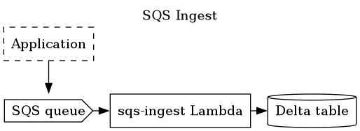

ifdef::env-github[]
:tip-caption: :bulb:
:note-caption: :information_source:
:important-caption: :heavy_exclamation_mark:
:caution-caption: :fire:
:warning-caption: :warning:
endif::[]
:toc: macro

= SQS Ingest

The `sqs-ingest` is the AWS SQS equivalent of
link:https://github.com/delta-io/kafka-delta-ingest[kafka-delta-ingest] insofar
that it allows the ingestion of JSON data from SQS and translatest each record
into a row appended onto a link:https://delta.io[Delta Lake] table.

toc::[]

for simplicity's sake this Lambda is intended to only work with a single Delta
table. For ingestion to multiple Delta tables, deploy different instances of
this Lambda triggered by different SQS queues.

== Environment Variables

|===

| Name | Default Value | Notes

| `RUST_LOG`
| `error`
| Set the log level, e.g. `trace`, `debug`, `info`, `warn`, `error`. Can be scoped to specific modules, i.e. `sqs-ingest=debug`

| `DELTA_TABLE_URI`
|
| **Required:** Set to the `s3://` URL of the Delta table which should be appended

| `BUFFER_MORE_QUEUE_URL`
|
| Set to the SQS queue URL that triggered the function to buffer more messages per-invocation

| `BUFFER_MORE_MESSAGES`
| _0_
| Set to an integer value of the number of _additional_ messages to consume from SQS. This setting can be used to make sqs-ingest retrieve more messages than those it was triggered with, this can help increase the number of messages written to S3 per-Lambda invocation.

| `AWS_S3_LOCKING_PROVIDER`
| _null_
| Set to `dynamodb` to enable safe concurrent writes to the table

| `DYNAMO_LOCK_TABLE_NAME`
| _null_
| Set to the DynamoDB table used for locking, required for safe concurrent writes.

| `UNWRAP_SNS_ENVELOPE`
| _null_
| Should only be set if messages are first passing through SNS -> SQS. Ensure "raw delivery" is enabled on the topic subscription!

|===
